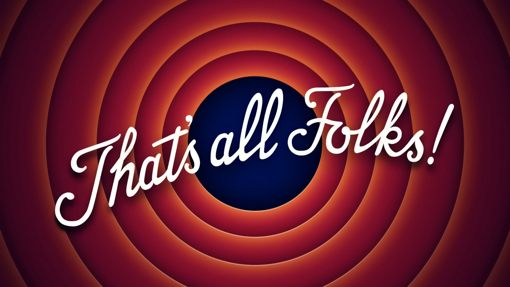

<!-- .slide: data-menu-title="Frontpage"; data-background-image="images/Diversity-accessibility.jpg"; data-background-opacity="0.3"; background-size:contain -->
# WTG Samen Krachtig in de Wijert

23-10-2026

Note:

- Printen: kan vanuit Chrome met url suffix: ?print-pdf
- f = full screen (escape to exit)
- o = overview slides
- g = go to slide
- s = speaker notes
- v,b,.,/ = pause/resume
- ? = toon alle shortcuts
- Theme is set in the index.html file, logo in .css file

---

<!-- .slide: data-menu-title="Om wie gaat het"; data-background-image="images/Diversity-accessibility.jpg"; data-background-opacity="0.1"; background-size:cover -->
## Even voorstellen: WTG

- Mensen met een fysieke handicap, mobiliteitsgedoe en/of begrensde energie
- Doven en slechthorenden
- Blinden en slechtzienden
- Mensen met een verstandelijke beperking
- Mensen met een psychische handicap

---

<!-- .slide: data-menu-title="Projecten"; data-background-image="images/Diversity-accessibility.jpg"; data-background-opacity="0.3"; background-size:cover -->
## Gemeente  Groningen en WTG

Gemeente Groningen

- 17 Directies, 7 Gebiedsteams
- Toegankelijkheids agenda (LIA-2026)
- Coordinator toegankelijkheid
- Ambassadeurs toegankelijkheid

Organisatie

- Samenwerkingsovereenkomst WTG en gemeente
- Overleg met wethouder toegankelijkheid

---

<!-- .slide: data-menu-title="Projecten"; data-background-image="images/Diversity-accessibility.jpg"; data-background-opacity="0.3"; background-size:cover -->
### project aanpak

Vanaf begin aanhaken:

- Pakket van Eisen (PvE)
- Schets ontwerp (SO)
- Voorlopig Ontwerp (VO)
- Definitief Ontwerp (DO)
- Uitvoerings Ontwerp (UO)

Sinds 2025: NEN 9120

---

<!-- .slide: data-menu-title="Om wie gaat het"; data-background-image="images/Diversity-accessibility.jpg"; data-background-opacity="0.1"; background-size:cover -->
## Voorbeelden projecten

- Campus Esserberg
- Vrijdag (muziekschool etc.)
- Hoofdstation
- Scholen nieuwbouw/renovatie
- Nieuwe Markt
- Herinrichting straten (o.a. centrum)
- Grote Markt / Hoofdloopwerk Groningen centrum
- Verkeersroutes (wegen, rotondes, ...)
- Museum aan de Aa
- Dudok aan het Diep
- ...

---

<!-- .slide: data-menu-title="Om wie gaat het"; data-background-image="images/Diversity-accessibility.jpg"; data-background-opacity="0.1"; background-size:cover -->
## Wat gaat er goed: beleid

- Sportbeleid
- Sociale Basis
- Communicatiebeleid
- Toegankelijkheid Openbare Ruimte (TOR)

---

<!-- .slide: data-menu-title="Om wie gaat het"; data-background-image="images/Diversity-accessibility.jpg"; data-background-opacity="0.1"; background-size:cover -->
## Wat gaat niet goed : voorbeelden

- WMO-taxi en bekeuringen
- Gebiedsteams en toegankelijkheid
- Sport en vervoer
- Rateltikkers (gescheiden verkeersstromen)

Oorzaak: bewustzijn toegankelijkheid ontbreekt!

---

<!-- .slide: data-menu-title="Om wie gaat het"; data-background-image="images/Diversity-accessibility.jpg"; data-background-opacity="0.1"; background-size:cover -->
## Wat doen we hieraan

- Mobiliseren wethouder, B&W, Gemeenteraad
- Continuiteit coordinator
- Continuiteit/support ambassadeurs
- LIA Pilots 2026
- Ander soort Locale Incluse Agenda 2027
- Doel:  Toegankelijkheid in beleid en organisatie

---

<!-- .slide: data-menu-title="Om wie gaat het"; data-background-image="images/Diversity-accessibility.jpg"; data-background-opacity="0.1"; background-size:cover -->
## Voorbeeld: Esserberg

- Schetsontwerp
- Voorlopig ontwerp
- Rol/taak van de gemeente

Note:

- 1e sessie: Architect komt met schetsontwerp vol problemen
- hoogteverschillen binnen en buiten
- stevig onbegrip: het moet toegankelijk worden
- niet blije architect
  
- 2e sessie: Architect toont ontwerp vrijwel toegankelijk
- geen hoogteverschillen buiten, enkele binnen
- goed doodacht

Moet niet WTG rol zijn: de gemeente moet dit vragen/afdwingen

---

###

<!-- .element height="90%" width="90%" -->

**Bedankt voor uw aandacht!**
